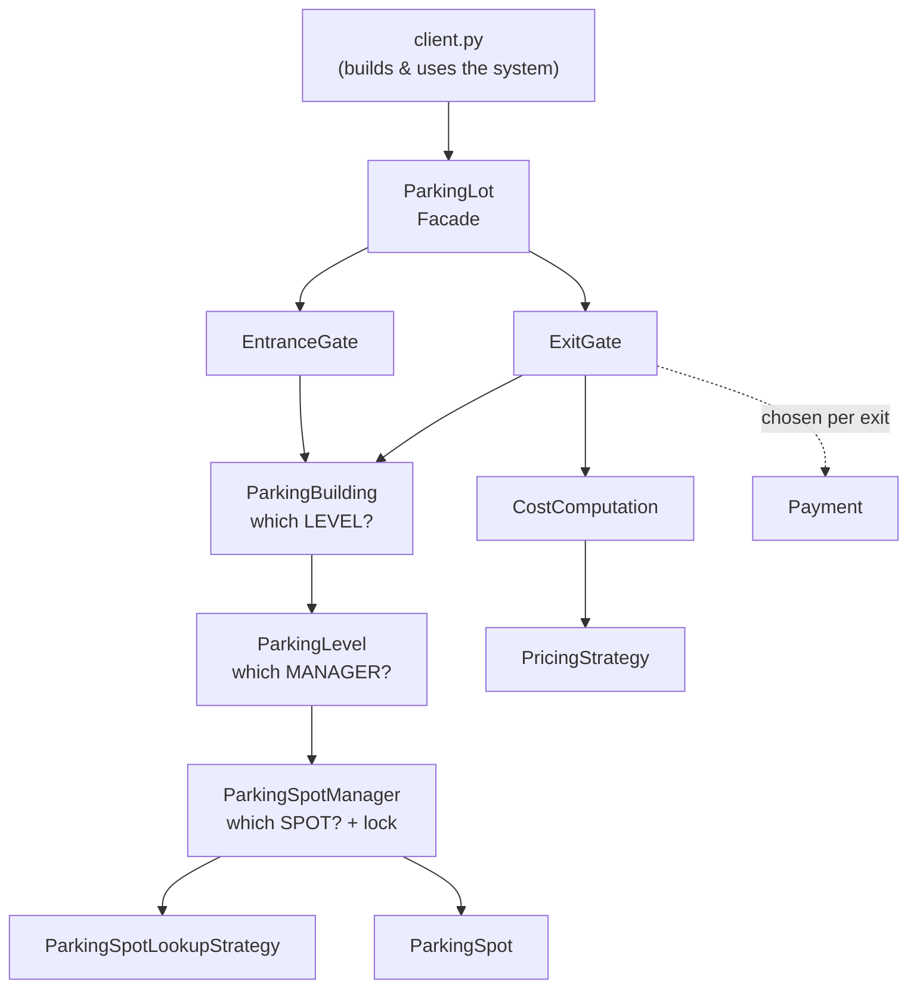
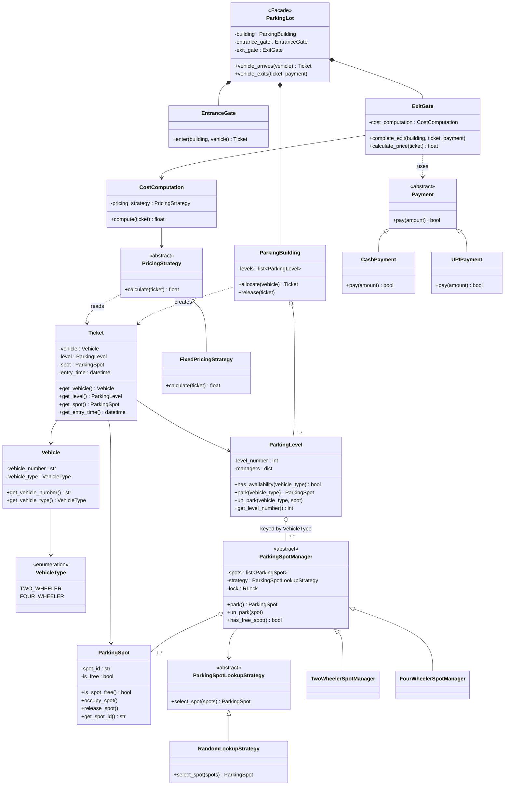
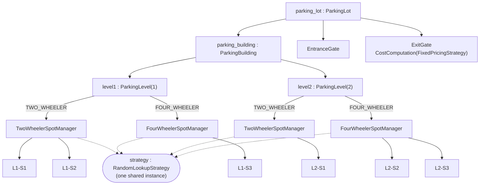
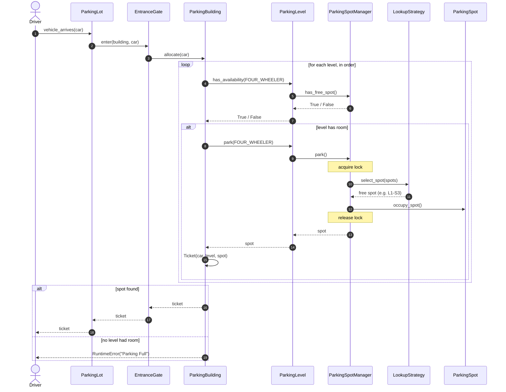
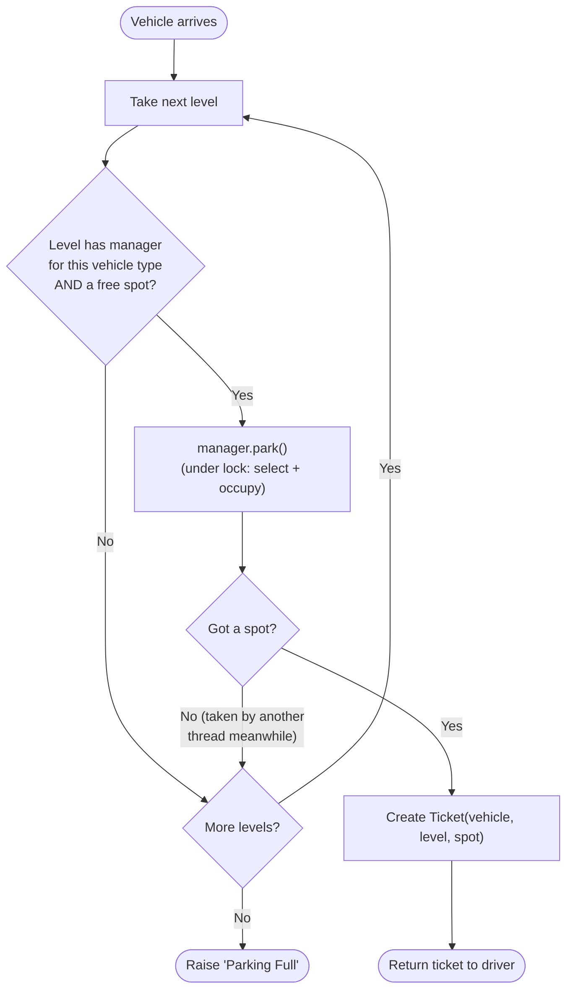
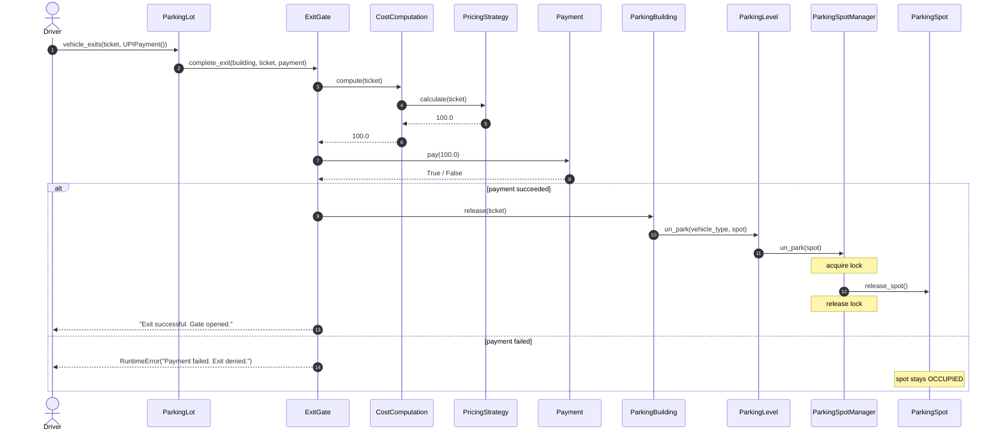
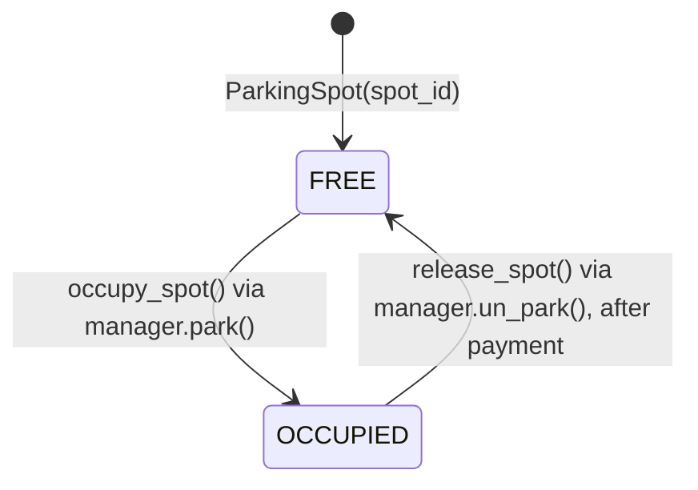
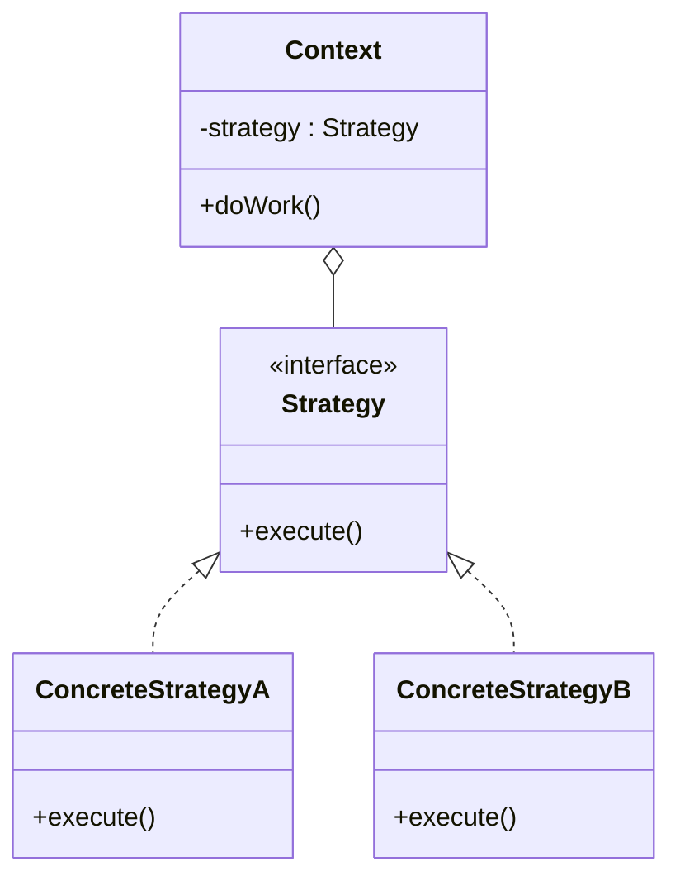
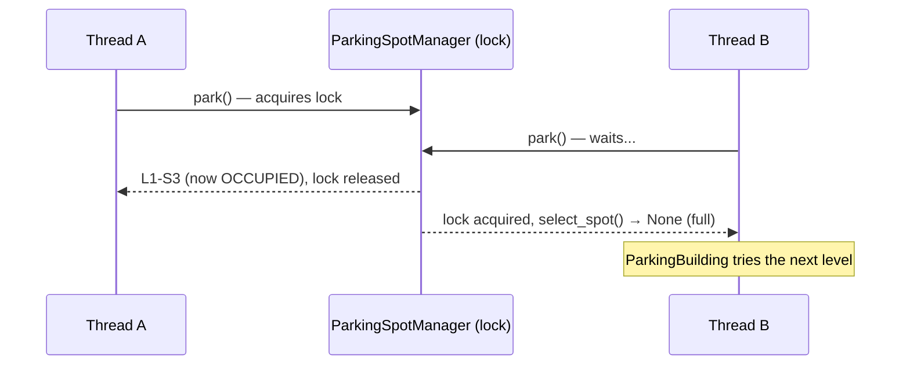

# Parking Lot — Low Level Design

A teaching example of a multi-level parking lot built with object-oriented design principles and three classic design patterns: **Strategy**, **Facade**, and **Dependency Injection** (via a composition root).

Read this file top to bottom once. Then open the code: every module starts with a docstring that repeats the relevant part of this explanation next to the code it describes.

---

## Table of Contents

1. [Requirements](#1-requirements)
2. [How to Run](#2-how-to-run)
3. [Folder Structure](#3-folder-structure)
4. [The Big Picture](#4-the-big-picture)
5. [UML Class Diagram](#5-uml-class-diagram)
6. [Object Diagram — What client.py Builds](#6-object-diagram--what-clientpy-builds)
7. [Step by Step: A Vehicle Arrives](#7-step-by-step-a-vehicle-arrives)
8. [Step by Step: A Vehicle Exits](#8-step-by-step-a-vehicle-exits)
9. [Parking Spot State Diagram](#9-parking-spot-state-diagram)
10. [Class by Class Reference](#10-class-by-class-reference)
11. [Design Patterns Used](#11-design-patterns-used)
12. [SOLID Principles in This Design](#12-solid-principles-in-this-design)
13. [Concurrency](#13-concurrency)
14. [Tracing the Demo Run](#14-tracing-the-demo-run)
15. [Extending the Design (Exercises)](#15-extending-the-design-exercises)
16. [Known Limitations](#16-known-limitations)

---

## 1. Requirements

These are the requirements the design answers. In an interview, write these down first.

**Functional**

| # | Requirement | Where it is handled |
|---|---|---|
| F1 | The building has multiple levels. | `ParkingBuilding` holds a list of `ParkingLevel` |
| F2 | Each level has spots for different vehicle types (two-wheeler, four-wheeler). | `ParkingLevel` holds one `ParkingSpotManager` per `VehicleType` |
| F3 | A vehicle can only park in a spot meant for its type. | `ParkingLevel` routes by `VehicleType` |
| F4 | On entry, a vehicle gets a spot and a ticket. | `EntranceGate` → `ParkingBuilding.allocate()` → `Ticket` |
| F5 | If there is no spot, entry is refused. | `ParkingBuilding.allocate()` raises `"Parking Full"` |
| F6 | On exit, the fee is computed and paid, then the spot is freed. | `ExitGate.complete_exit()` |
| F7 | Pricing rules can change (flat, hourly, ...). | `PricingStrategy` |
| F8 | Drivers can pay in different ways (cash, UPI, ...). | `Payment` |
| F9 | The rule for choosing a free spot can change. | `ParkingSpotLookupStrategy` |

**Non-functional**

| # | Requirement | Where it is handled |
|---|---|---|
| N1 | Two cars must never get the same spot, even when they arrive at the same time. | Lock inside `ParkingSpotManager` |
| N2 | New vehicle types, pricing rules, and payment methods can be added without editing existing classes. | Strategy pattern + dictionary of managers |

---

## 2. How to Run

From **this** folder (the one containing `client.py`):

```bash
python3 client.py
```

Expected output:

```
Parking allocated at level: 1 spot: L1-S1
Parking allocated at level: 1 spot: L1-S3
Cash paid: 100.0
Exit successful. Gate opened.
UPI paid: 100.0
Exit successful. Gate opened.
```

> Do **not** run files inside the sub-folders directly (for example `python3 parking_lot/entrance_gate.py`).
> They are modules meant to be imported. Python looks for imports starting from the folder of the file you run, so their imports only resolve when you run `client.py`.

---

## 3. Folder Structure

```
parking_lot/
├── client.py                      # Composition root: builds everything and runs a demo
├── vehicle.py                     # Vehicle entity
├── parking_spot.py                # ParkingSpot entity (FREE / OCCUPIED)
├── ticket.py                      # Ticket issued on entry, consumed on exit
│
├── enums/
│   └── vehicle_type.py            # VehicleType enum
│
├── parking_lot/                   # Core of the system
│   ├── parking_lot.py             # ParkingLot  (Facade)
│   ├── entrance_gate.py           # EntranceGate
│   ├── exit_gate.py               # ExitGate
│   ├── parking_building.py        # ParkingBuilding (all levels)
│   └── parking_level.py           # ParkingLevel (one floor)
│
├── spot_managers/                 # Own and guard spots of one vehicle type
│   ├── parking_spot_manager.py    # Abstract base (Strategy Context + lock)
│   ├── two_wheeler_spot_manager.py
│   └── four_wheeler_spot_manager.py
│
├── spot_lookup_strategy/          # WHICH free spot to give  (Strategy)
│   ├── parking_lookup_strategy.py # Abstract strategy
│   └── random_lookup_strategy.py  # First-fit implementation
│
├── pricing/                       # HOW MUCH to charge  (Strategy)
│   ├── pricing_strategy.py        # Abstract strategy
│   ├── fixed_pricing_strategy.py  # Flat 100 per visit
│   └── cost_computation.py        # Strategy Context
│
└── payment/                       # HOW the driver pays  (Strategy)
    ├── payment.py                 # Abstract strategy
    ├── cash_payment.py
    └── upi_payment.py
```

Each folder groups classes that **change for the same reason**. Pricing rules change → only `pricing/` is touched. A new payment method → only `payment/`.

---

## 4. The Big Picture

The system is a **tree of responsibilities**. Each layer asks the layer below it and knows nothing about the layers further down.



Each class answers exactly one question:

| Class | Question it answers |
|---|---|
| `ParkingLot` | "What can a driver do?" → arrive, exit |
| `EntranceGate` | "Let this vehicle in." |
| `ExitGate` | "Let this vehicle out, after it pays." |
| `ParkingBuilding` | "Which **level** has room?" |
| `ParkingLevel` | "Which **manager** handles this vehicle type?" |
| `ParkingSpotManager` | "Occupy a spot safely." |
| `ParkingSpotLookupStrategy` | "Which **spot** among the free ones?" |
| `CostComputation` / `PricingStrategy` | "How much?" |
| `Payment` | "How is it paid?" |

---

## 5. UML Class Diagram



**How to read the arrows**

| Arrow | Meaning | Example |
|---|---|---|
| `<|--` (hollow triangle) | **Inheritance**, "is a" | `CashPayment` *is a* `Payment` |
| `*--` (filled diamond) | **Composition**, strong "has a" | `ParkingLot` *has* its gates |
| `o--` (hollow diamond) | **Aggregation**, "has a" whose parts could be shared | `ParkingBuilding` *has* levels |
| `-->` | **Association**, holds a reference | `Ticket` → `ParkingSpot` |
| `..>` (dashed) | **Dependency**, uses temporarily | `ExitGate` uses a `Payment` passed in per call |

---

## 6. Object Diagram — What `client.py` Builds

A class diagram shows *types*. An object diagram shows the actual *instances* at runtime. This is the exact setup that `client.py` creates:



Capacity of this building:

| Level | Two-wheeler spots | Four-wheeler spots |
|---|---|---|
| 1 | L1-S1, L1-S2 | L1-S3 |
| 2 | L2-S1 | L2-S2, L2-S3 |
| **Total** | **3** | **3** |

One `RandomLookupStrategy` object is shared by all four managers. This is safe because the strategy holds no state: it only reads the list it is given.

---

## 7. Step by Step: A Vehicle Arrives

### Sequence diagram



### Allocation flowchart



### Walkthrough in words

1. **Driver → `ParkingLot.vehicle_arrives(vehicle)`**
   The facade is the only object the driver talks to. It forwards to the entrance gate.

2. **`EntranceGate.enter(building, vehicle)`**
   The gate represents the physical entrance. For now it only asks the building for a spot. Later it could scan number plates or check reservations.

3. **`ParkingBuilding.allocate(vehicle)`**
   The building walks its levels **in the order they were given** (level 1 first).

4. **`ParkingLevel.has_availability(vehicle_type)`**
   The level looks up its manager for this vehicle type in its dictionary:
   - No manager → this level has no spots of that type → `False`.
   - Manager exists → ask it `has_free_spot()`.

5. **`ParkingLevel.park(vehicle_type)` → `ParkingSpotManager.park()`**
   Inside **one lock**, the manager:
   1. asks its **lookup strategy** to choose a free spot,
   2. marks that spot `OCCUPIED`.

   Doing both under the same lock is what stops two cars from getting the same spot.

6. **Back in `ParkingBuilding`**
   If a spot came back, a `Ticket(vehicle, level, spot)` is created with the current time and returned all the way up.
   If `None` came back (another thread took the last spot between step 4 and step 5), the loop moves on to the next level.

7. **No level worked** → `RuntimeError("Parking Full")`.

---

## 8. Step by Step: A Vehicle Exits

### Sequence diagram



### Walkthrough in words

1. **Driver → `ParkingLot.vehicle_exits(ticket, payment)`**
   The driver hands over the ticket and picks a payment method. The payment method is chosen **per exit**, so the same gate accepts cash from one driver and UPI from the next.

2. **`ExitGate.calculate_price(ticket)` → `CostComputation.compute(ticket)` → `PricingStrategy.calculate(ticket)`**
   The gate doesn't know the pricing rule. `FixedPricingStrategy` returns `100.0`. An hourly strategy would read `ticket.get_entry_time()`.

3. **`payment.pay(amount)`**
   Returns `True` on success.
   On `False` the gate raises `RuntimeError`, and **the spot is not released**: the car is still physically there.

4. **`ParkingBuilding.release(ticket)`**
   No search is needed. The ticket already holds the exact level and spot:
   `ticket.level.un_park(vehicle_type, ticket.spot)` → manager → `spot.release_spot()` (under lock).

5. **Gate opens.**

> **Why release only after payment?**
> If the spot were freed first and the payment then failed, the spot would show as FREE while a car is still in it, and the next arriving car would be sent there.

---

## 9. Parking Spot State Diagram



Only `ParkingSpotManager` calls these two methods, and always while holding its lock.

---

## 10. Class by Class Reference

### Entities (plain data)

| Class | File | Responsibility |
|---|---|---|
| `VehicleType` | [enums/vehicle_type.py](enums/vehicle_type.py) | Closed set of vehicle categories; the key used to route to a spot manager. |
| `Vehicle` | [vehicle.py](vehicle.py) | Number plate + type. No behaviour. |
| `ParkingSpot` | [parking_spot.py](parking_spot.py) | One physical spot; FREE or OCCUPIED. |
| `Ticket` | [ticket.py](ticket.py) | Receipt linking entry to exit: vehicle, level, spot, entry time. |

### Spot management

| Class | File | Responsibility |
|---|---|---|
| `ParkingSpotManager` | [spot_managers/parking_spot_manager.py](spot_managers/parking_spot_manager.py) | Owns spots of one type on one level. Thread-safe park / un_park. Delegates *which* spot to a strategy. |
| `TwoWheelerSpotManager` | [spot_managers/two_wheeler_spot_manager.py](spot_managers/two_wheeler_spot_manager.py) | Manager for two-wheeler spots (extension point). |
| `FourWheelerSpotManager` | [spot_managers/four_wheeler_spot_manager.py](spot_managers/four_wheeler_spot_manager.py) | Manager for four-wheeler spots (extension point). |
| `ParkingSpotLookupStrategy` | [spot_lookup_strategy/parking_lookup_strategy.py](spot_lookup_strategy/parking_lookup_strategy.py) | Abstract "choose a free spot" algorithm. |
| `RandomLookupStrategy` | [spot_lookup_strategy/random_lookup_strategy.py](spot_lookup_strategy/random_lookup_strategy.py) | First free spot in list order (despite the name). |

### Structure and flow

| Class | File | Responsibility |
|---|---|---|
| `ParkingLevel` | [parking_lot/parking_level.py](parking_lot/parking_level.py) | One floor. Maps `VehicleType` → manager and forwards calls. |
| `ParkingBuilding` | [parking_lot/parking_building.py](parking_lot/parking_building.py) | All levels. Picks the level, creates tickets, releases spots. |
| `EntranceGate` | [parking_lot/entrance_gate.py](parking_lot/entrance_gate.py) | Entry: asks the building for a ticket. |
| `ExitGate` | [parking_lot/exit_gate.py](parking_lot/exit_gate.py) | Exit: price → pay → release, in that order. |
| `ParkingLot` | [parking_lot/parking_lot.py](parking_lot/parking_lot.py) | Facade: `vehicle_arrives()` and `vehicle_exits()`. |

### Pricing and payment

| Class | File | Responsibility |
|---|---|---|
| `PricingStrategy` | [pricing/pricing_strategy.py](pricing/pricing_strategy.py) | Abstract "how much does this visit cost". |
| `FixedPricingStrategy` | [pricing/fixed_pricing_strategy.py](pricing/fixed_pricing_strategy.py) | Flat 100 per visit. |
| `CostComputation` | [pricing/cost_computation.py](pricing/cost_computation.py) | Context that holds the pricing strategy; place for tax / discounts. |
| `Payment` | [payment/payment.py](payment/payment.py) | Abstract "collect this amount"; returns success. |
| `CashPayment` | [payment/cash_payment.py](payment/cash_payment.py) | Pay by cash. |
| `UPIPayment` | [payment/upi_payment.py](payment/upi_payment.py) | Pay by UPI. |

### Wiring

| Class | File | Responsibility |
|---|---|---|
| `ParkingLotClient` | [client.py](client.py) | Composition root: builds every object and runs the demo. |

---

## 11. Design Patterns Used

### 11.1 Strategy (used three times)

> Define a family of algorithms, put each in its own class, and make them interchangeable.

| Strategy interface | Context (who holds it) | Concrete strategies | Chosen when |
|---|---|---|---|
| `ParkingSpotLookupStrategy` | `ParkingSpotManager` | `RandomLookupStrategy` | When the manager is built |
| `PricingStrategy` | `CostComputation` | `FixedPricingStrategy` | When the exit gate is built |
| `Payment` | `ExitGate` (per call) | `CashPayment`, `UPIPayment` | On every exit, by the driver |



**Without Strategy**, `ParkingSpotManager`, `ExitGate`, and `CostComputation` would each contain long `if/elif` chains, and every new rule would mean editing and re-testing them.

See also: [../strategy_design_pattern/](../strategy_design_pattern/) in this repo for a standalone example.

### 11.2 Facade

> Provide one simple interface to a complex subsystem.

`ParkingLot` hides gates, building, levels, managers, strategies, pricing, and payment behind two calls:

```python
ticket = parking_lot.vehicle_arrives(vehicle)
parking_lot.vehicle_exits(ticket, payment)
```

### 11.3 Dependency Injection and the Composition Root

No class builds its own collaborators. Every dependency is passed in through a constructor or a method:

```python
ParkingSpotManager(spots, strategy)       # strategy injected
ExitGate(CostComputation(FixedPricingStrategy()))  # pricing injected
ParkingLot(building, entrance_gate, exit_gate)     # everything injected
```

All the wiring happens in one place, `client.py`, called the **composition root**. To change behaviour you change one line there. To test a class you pass in fakes, for example a `Payment` that always returns `False` to test the failure path.

### 11.4 Template for extension: abstract base + subclasses

`ParkingSpotManager` holds the shared logic. `TwoWheelerSpotManager` and `FourWheelerSpotManager` add nothing yet, but give each vehicle type its own place for special rules later.

---

## 12. SOLID Principles in This Design

| Principle | Where you can see it |
|---|---|
| **S** — Single Responsibility | Each class answers one question (see [section 4](#4-the-big-picture)). `ParkingBuilding` never computes prices; `ExitGate` never picks spots. |
| **O** — Open/Closed | New pricing / payment / lookup rule = new class. New vehicle type = new enum member + new manager registered in `client.py`. No existing logic is edited. |
| **L** — Liskov Substitution | Any `Payment` subclass can replace another; `ExitGate` only relies on `pay()` returning a `bool`. The same holds for the pricing and lookup strategies. |
| **I** — Interface Segregation | Each abstract class has exactly one method (`pay`, `calculate`, `select_spot`). Implementers are never forced to write methods they don't need. |
| **D** — Dependency Inversion | High-level classes depend on abstractions: `ExitGate` → `Payment`, `CostComputation` → `PricingStrategy`, `ParkingSpotManager` → `ParkingSpotLookupStrategy`. Concrete classes are chosen only in `client.py`. |

---

## 13. Concurrency

A real parking lot has several entrances working at the same time. The dangerous moment is **"find a free spot, then occupy it"**:

```
Time →   Thread A (Gate 1)              Thread B (Gate 2)
  t1     select_spot() → L1-S3 free
  t2                                    select_spot() → L1-S3 free   ← still free!
  t3     occupy_spot(L1-S3)
  t4                                    occupy_spot(L1-S3)            ← same spot twice
```

This is a **check-then-act race condition**.

**The fix:** `ParkingSpotManager.park()` does both steps inside `with self.lock:`, so only one thread at a time can select and occupy a spot of that manager.



Design notes:

- **The lock is per manager**, not global. Cars and bikes, and different levels, never block each other. Only requests for the *same* manager wait.
- **`has_free_spot()` can be stale.** It is only a quick filter. The real guarantee is inside `park()`, which is why `ParkingBuilding.allocate()` checks `if spot is not None` and moves on to the next level.
- **`RLock`** (re-entrant lock) is used so the same thread can take the lock again without deadlocking itself.

---

## 14. Tracing the Demo Run

What happens, line by line, when you run `python3 client.py`:

| Step | Call | What happens inside | Output |
|---|---|---|---|
| 1 | `vehicle_arrives(bike)` | Level 1 → TWO_WHEELER manager → first free spot `L1-S1` → occupied → Ticket t1 | `Parking allocated at level: 1 spot: L1-S1` |
| 2 | `vehicle_arrives(car)` | Level 1 → FOUR_WHEELER manager → first free spot `L1-S3` → occupied → Ticket t2 | `Parking allocated at level: 1 spot: L1-S3` |
| 3 | `vehicle_exits(t1, CashPayment())` | Fixed price 100.0 → cash paid → `L1-S1` freed | `Cash paid: 100.0`<br/>`Exit successful. Gate opened.` |
| 4 | `vehicle_exits(t2, UPIPayment())` | Fixed price 100.0 → UPI paid → `L1-S3` freed | `UPI paid: 100.0`<br/>`Exit successful. Gate opened.` |

**Try it:** add a second car before any exits. Level 1 has only one four-wheeler spot, so the second car is sent to `L2-S2`. Add two more cars and the last one gets `RuntimeError: Parking Full`.

---

## 15. Extending the Design (Exercises)

Each exercise needs **only new classes plus a change in `client.py`**. That is the proof that the design is open for extension.

1. **Hourly pricing** — create `HourlyPricingStrategy(PricingStrategy)` that uses `ticket.get_entry_time()`. Inject it into `ExitGate` via `CostComputation`.
2. **Vehicle-based pricing** — charge bikes 20 and cars 50 using `ticket.get_vehicle().get_vehicle_type()`.
3. **Card payment** — add `CardPayment(Payment)`. Make one that returns `False` and watch the exit get refused with the spot still occupied.
4. **A truly random lookup** — write a strategy using `random.choice()` over the free spots.
5. **Nearest-spot lookup** — give `ParkingSpot` a `distance` and pick the free spot with the smallest one.
6. **New vehicle type** — add `VehicleType.HEAVY_VEHICLE` and a `HeavyVehicleSpotManager`, and register it only on level 1 (e.g. ground floor for trucks). Notice that `ParkingLevel` and `ParkingBuilding` don't change.
7. **Tax** — in `CostComputation.compute()`, add 18% GST on top of every strategy's price.
8. **Display board** — show free spots per level and vehicle type. Where does the counting belong? (Hint: the manager already has the spots and the lock.)

---

## 16. Known Limitations

Good discussion points with students. These are deliberately left simple.

| Limitation | Why it matters | Possible fix |
|---|---|---|
| `RandomLookupStrategy` is actually first-fit. | The name is misleading. | Rename it to `FirstFitLookupStrategy`, or implement real randomness. |
| A ticket can be used to exit twice. | The second exit charges again and "frees" a spot that may now belong to another car. | Give `Ticket` a status (`ACTIVE` / `PAID`) and reject non-active tickets at the exit gate. |
| `Ticket` has no id. | A real system must look tickets up (e.g. a lost-ticket desk). | Add a unique `ticket_id` and keep active tickets in a dictionary. |
| One vehicle can park twice. | Nothing checks that a number plate is already inside. | Track active number plates at the entrance gate. |
| Payments are simulated. | `pay()` always succeeds. | Integrate a gateway and handle timeouts and refunds. |
| Levels are always tried in the same order. | Lower floors fill up first. | Make level selection another strategy. |
