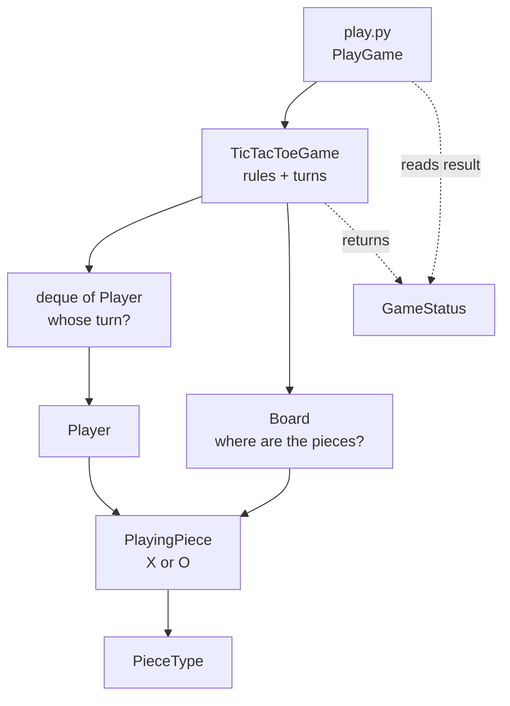
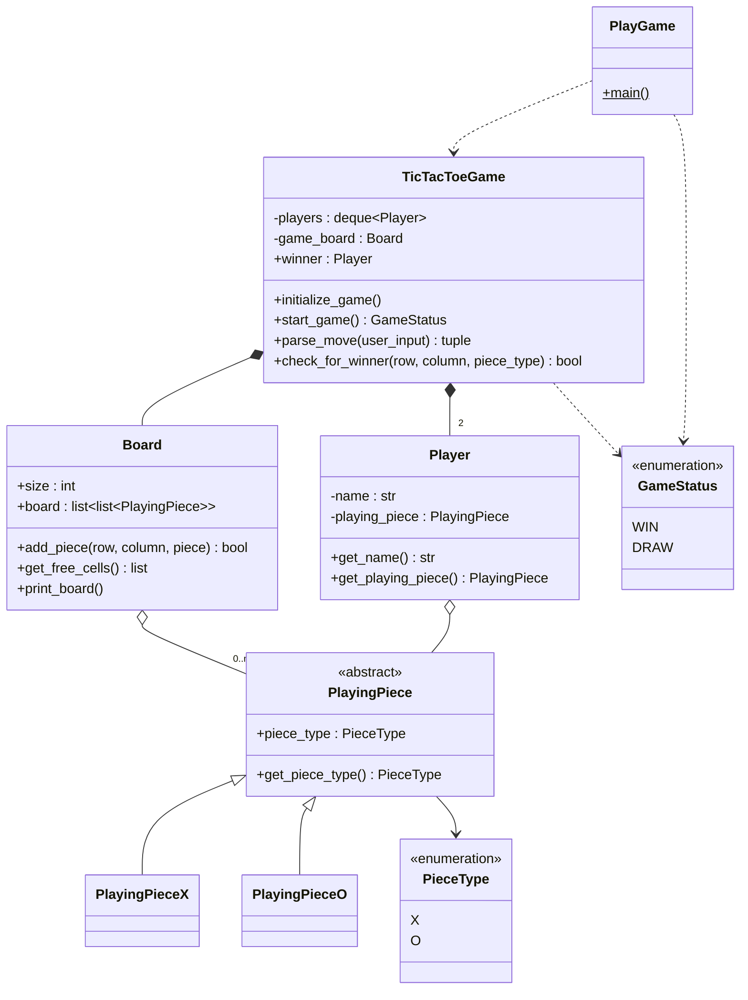
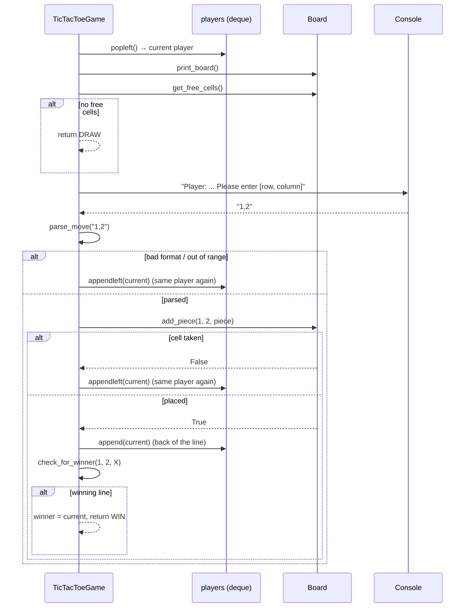

# Tic-Tac-Toe — Low Level Design

A teaching example of a console tic-tac-toe game built with object-oriented design: small classes with one job each, an abstract base class with concrete subclasses, enums for closed sets of values, and a queue for turn order.

Read this file top to bottom once. Then open the code: every module starts with a docstring that repeats the relevant part of this explanation next to the code it describes.

---

## Table of Contents

1. [Requirements](#1-requirements)
2. [How to Run](#2-how-to-run)
3. [Folder Structure](#3-folder-structure)
4. [The Big Picture](#4-the-big-picture)
5. [UML Class Diagram](#5-uml-class-diagram)
6. [Step by Step: One Turn](#6-step-by-step-one-turn)
7. [Turn Order with a Queue](#7-turn-order-with-a-queue)
8. [Checking for a Winner](#8-checking-for-a-winner)
9. [Class by Class Reference](#9-class-by-class-reference)
10. [Design Ideas Used](#10-design-ideas-used)
11. [SOLID Principles in This Design](#11-solid-principles-in-this-design)
12. [Tracing a Sample Game](#12-tracing-a-sample-game)
13. [Extending the Design (Exercises)](#13-extending-the-design-exercises)
14. [Known Limitations](#14-known-limitations)

---

## 1. Requirements

These are the requirements the design answers. In an interview, write these down first.

**Functional**

| # | Requirement | Where it is handled |
|---|---|---|
| F1 | Two players take turns; one plays X, the other O. | `TicTacToeGame.initialize_game()` + `deque` of `Player` |
| F2 | The board is a 3 x 3 grid. | `Board(3)` |
| F3 | A player places a piece on an empty cell. | `Board.add_piece()` |
| F4 | A taken cell, an out-of-range cell or badly typed input is refused, and the same player tries again. | `TicTacToeGame.parse_move()` + `add_piece()` returning `False` + `appendleft()` |
| F5 | A full row, column or diagonal of one symbol wins. | `TicTacToeGame.check_for_winner()` |
| F6 | A full board with no winner is a draw. | `Board.get_free_cells()` returns `[]` → `GameStatus.DRAW` |
| F7 | The result is announced at the end. | `PlayGame.main()` |

**Non-functional**

| # | Requirement | Where it is handled |
|---|---|---|
| N1 | Board size and number of players can change without rewriting the rules. | `Board(size)`, winner check loops over `size`, turn order is a queue |
| N2 | The winner check is cheap. | Only the lines through the last move are checked — O(n) per move |

---

## 2. How to Run

From **this** folder (the one containing `play.py`):

```bash
python3 play.py
```

Enter moves as `row,column` with 0-based indexes (`0,0` is top-left, `2,2` is bottom-right).

Example session (Player1 wins on the top row):

```
===>>> TicTacToe Game

     |      |      |
     |      |      |
     |      |      |
Player: Player1 - Please enter [row, column]: 0,0
...
Player: Player1 - Please enter [row, column]: 0,2
X    | X    | X    |
O    | O    |      |
     |      |      |

===>>> GAME OVER: Player1 won the game
```

To replay a game without typing, pipe the moves in:

```bash
printf '0,0\n1,0\n0,1\n1,1\n0,2\n' | python3 play.py
```

> Do **not** run the other files directly (for example `python3 game.py`).
> They are modules meant to be imported. Python looks for imports starting from the folder of the file you run, so their imports only resolve when you run `play.py`.

---

## 3. Folder Structure

```
tic_tac_toe_design/
├── play.py               # Entry point: starts a game and prints the result
├── game.py               # TicTacToeGame: turns, move validation, winner check
├── board.py              # Board: N x N grid of pieces
├── player.py             # Player: name + piece
├── playing_piece.py      # PlayingPiece: abstract base for pieces
├── playing_piece_x.py    # PlayingPieceX
├── playing_piece_o.py    # PlayingPieceO
├── piece_type.py         # PieceType enum (X, O)
└── game_status.py        # GameStatus enum (WIN, DRAW)
```

The project is small, so every file sits in one folder. If it grew (AI players, a GUI, saved games), the natural split would be `model/` (board, player, pieces, enums) and `game/` (rules and turn loop).

---

## 4. The Big Picture

Each class answers exactly one question and only talks to the classes below it.



| Class | Question it answers |
|---|---|
| `PlayGame` | "Start a game and tell me who won." |
| `TicTacToeGame` | "Whose turn is it, is this move legal, and did it win?" |
| `Board` | "Which cells hold which piece, and which are free?" |
| `Player` | "Who is this, and which piece do they place?" |
| `PlayingPiece` | "Which symbol is this?" |
| `PieceType` | "Which symbols exist?" |
| `GameStatus` | "How did the game end?" |

---

## 5. UML Class Diagram



Arrow key: `<|--` inherits, `*--` owns (creates and controls the lifetime), `o--` holds a reference, `..>` uses.

---

## 6. Step by Step: One Turn



**In words:**

1. Take the next player from the front of the queue.
2. Show the board. If there are no free cells, the game is a draw.
3. Read `row,column`. If it is not two integers inside the board, reject it.
4. Ask the board to place the piece. If the cell is taken, reject it.
5. A rejected move puts the **same** player back at the **front** of the queue.
6. A valid move puts the player at the **back** of the queue, then checks for a win.

---

## 7. Turn Order with a Queue

A `deque` makes "whose turn is it" a data structure instead of an `if`:

```
start           [P1, P2]
P1 plays 0,0    popleft → P1, valid   → append(P1)      [P2, P1]
P2 plays 0,0    popleft → P2, taken   → appendleft(P2)  [P2, P1]
P2 plays 1,1    popleft → P2, valid   → append(P2)      [P1, P2]
```

There is no `current_player_index` and no `if player == player1`. Adding a third player is one more `append()` in `initialize_game()`.

---

## 8. Checking for a Winner

Only the last move can create a win, so only the lines **through that cell** are checked:

```
move at (1, 1) on a 3 x 3 board

   row 1:          (1,0) (1,1) (1,2)
   column 1:       (0,1) (1,1) (2,1)
   diagonal:       (0,0) (1,1) (2,2)
   anti-diagonal:  (0,2) (1,1) (2,0)
```

Each line stops at the first cell that is empty or holds the other symbol. That is at most `4n` comparisons per move, instead of checking all `2n + 2` lines of the board.

The diagonals are checked even when the move is not on them. That is still correct: if a diagonal the move is not on were already full of the current player's pieces, that player would have won on an earlier turn and the game would already be over.

---

## 9. Class by Class Reference

### Values

| Class | File | Responsibility |
|---|---|---|
| `PieceType` | [piece_type.py](piece_type.py) | Closed set of symbols (X, O). Compared by the winner check, printed by the board. |
| `GameStatus` | [game_status.py](game_status.py) | How a game ended: WIN or DRAW. |

### Entities

| Class | File | Responsibility |
|---|---|---|
| `PlayingPiece` | [playing_piece.py](playing_piece.py) | Abstract base: a piece that carries a `PieceType`. |
| `PlayingPieceX` | [playing_piece_x.py](playing_piece_x.py) | Piece marked X. |
| `PlayingPieceO` | [playing_piece_o.py](playing_piece_o.py) | Piece marked O. |
| `Player` | [player.py](player.py) | Name + the piece they place. No game logic. |
| `Board` | [board.py](board.py) | N x N grid: place a piece, list free cells, print. Knows nothing about turns or winning. |

### Rules and entry point

| Class | File | Responsibility |
|---|---|---|
| `TicTacToeGame` | [game.py](game.py) | Creates players and board, runs turns, validates moves, checks win / draw. |
| `PlayGame` | [play.py](play.py) | Starts the game and prints the result. |

---

## 10. Design Ideas Used

### 10.1 Abstract base class + concrete subclasses

`Board`, `Player` and `TicTacToeGame` only ever see a `PlayingPiece` and call `get_piece_type()`. They never ask "is this an X?". A new piece is a new subclass; the rest of the code is unchanged.

### 10.2 Enums for closed sets

`PieceType` and `GameStatus` replace magic strings. A typo such as `PieceType.Y` fails immediately instead of producing a game where nobody can win.

### 10.3 Composition over inheritance

A `Player` **has** a `PlayingPiece`; it is not a subclass of one. Switching sides is `player.set_playing_piece(PlayingPieceO())`, with no new classes.

### 10.4 Separation of state and rules

`Board` holds state, `TicTacToeGame` holds rules. The same `Board` could back a different grid game (e.g. Connect Four) with a different rules class.

---

## 11. SOLID Principles in This Design

| Principle | Where you can see it |
|---|---|
| **S** — Single Responsibility | `Board` stores pieces, `Player` names a participant, `TicTacToeGame` applies rules, `PlayGame` talks to the console about the result. |
| **O** — Open/Closed | A new piece type is a new enum member + subclass. A bigger board is `Board(n)`. More players is another `append()`. The winner check and turn loop don't change. |
| **L** — Liskov Substitution | Any `PlayingPiece` subclass can be given to a `Player` or placed on the `Board`; both only rely on `get_piece_type()`. |
| **I** — Interface Segregation | `PlayingPiece` exposes one method. Nothing is forced to implement what it doesn't use. |
| **D** — Dependency Inversion | Partly applied: `Board` and `Player` depend on the abstract `PlayingPiece`. `TicTacToeGame` still creates its own board and players (see [Known Limitations](#14-known-limitations)). |

---

## 12. Tracing a Sample Game

Input: `0,0` `1,0` `0,1` `1,1` `0,2`

| Turn | Player | Move | Board after | Queue after | Result |
|---|---|---|---|---|---|
| 1 | Player1 (X) | 0,0 | `X . .` / `. . .` / `. . .` | [P2, P1] | no win |
| 2 | Player2 (O) | 1,0 | `X . .` / `O . .` / `. . .` | [P1, P2] | no win |
| 3 | Player1 (X) | 0,1 | `X X .` / `O . .` / `. . .` | [P2, P1] | no win |
| 4 | Player2 (O) | 1,1 | `X X .` / `O O .` / `. . .` | [P1, P2] | no win |
| 5 | Player1 (X) | 0,2 | `X X X` / `O O .` / `. . .` | [P2, P1] | **row 0 full of X → WIN** |

Output ends with `===>>> GAME OVER: Player1 won the game`.

**Try it:** enter `0,0` twice in a row. The second time prints `Incorrect position chosen, try again!` and Player2 is asked again. Enter `-1,0` or `a,b` and you get `Invalid input, ...` instead.

---

## 13. Extending the Design (Exercises)

1. **Bigger board** — change `Board(3)` to `Board(4)`. Which methods need no change at all? (Answer: all of them.)
2. **Three players** — add `PieceType.Z`, `PlayingPieceZ` and a third `Player`. Notice the turn loop is untouched.
3. **Computer player** — make the move source pluggable: a `MoveStrategy` with `HumanMoveStrategy` (reads `input()`) and `RandomMoveStrategy` (picks from `get_free_cells()`). Give each `Player` one.
4. **Inject dependencies** — let `TicTacToeGame.__init__` accept the players and board instead of creating them, and build them in `play.py`. Now the game is easy to test with a pre-filled board.
5. **Early draw detection** — end the game as soon as no line can be won by anyone, instead of waiting for a full board.
6. **Undo** — keep a stack of moves in `TicTacToeGame` and pop the last one.
7. **Win in a row of K** — on an N x N board, win with K in a row (Gomoku style). How does `check_for_winner()` change?

---

## 14. Known Limitations

Good discussion points with students. These are deliberately left simple.

| Limitation | Why it matters | Possible fix |
|---|---|---|
| `TicTacToeGame` creates its own `Board` and `Player`s. | Hard to test with a prepared position; hard to change setup without editing the class. | Pass them into the constructor (exercise 4). |
| Input is read with `input()` inside the game loop. | Rules and console I/O are mixed; no way to plug in a computer player or a GUI. | Move input behind a strategy (exercise 3). |
| Diagonals are checked on every move. | Harmless, but does extra work when the move is off the diagonal. | Only check the diagonal if `row == column`, the anti-diagonal if `row + column == size - 1`. |
| A draw is only detected when the board is full. | Players keep playing a game nobody can win. | Early draw detection (exercise 5). |
| `Board.board` is accessed directly by `TicTacToeGame`. | The game depends on the board's internal list layout. | Add `Board.get_piece(row, column)`. |
| Players are named "Player1" and "Player2". | No real names. | Ask for names in `play.py` and pass them in. |
| Running out of input (e.g. Ctrl+D) raises `EOFError`. | The game ends with a traceback. | Catch `EOFError` in `PlayGame.main()` and print "Game Ends". |
